# nocta-ui

CLI for [Nocta UI](https://github.com/66HEX/nocta-ui) - Modern, accessible React components built with TypeScript and Tailwind CSS.

## Quick Start

```bash
# Make sure Tailwind CSS is installed
npm install -D tailwindcss

# Initialize your project
npx nocta-ui init

# Add components
npx nocta-ui add button
npx nocta-ui add card
npx nocta-ui add alert
```

## Installation

No installation required! Use with `npx`:

```bash
npx nocta-ui <command>
```

Or install globally:

```bash
npm install -g nocta-ui
nocta-ui <command>
```

## Commands

### `init`
Initialize your project with Nocta UI configuration:
```bash
npx nocta-ui init
```
- **Validates Tailwind CSS installation** - Ensures Tailwind is properly installed
- Creates `nocta.config.json` configuration file
- Auto-detects your framework (Next.js, Vite)
- Supports Tailwind CSS v3 and v4
- **Interactive theme selection** - Choose from 4 color themes
- **Installs required dependencies:** `clsx`, `tailwind-merge` and `class-variance-authority`
- **Creates utility functions:** `@/lib/utils.ts` with `cn()` helper for className merging
- **Adds Nocta design tokens** - Beautiful color palette (nocta-50 to nocta-950)

**What happens during init:**
```bash
npx nocta-ui init

⠦ Checking Tailwind CSS installation...
✔ Found Tailwind CSS ^3.4.0 ✓
⠦ Detecting project framework...
✔ Found Next.js 15.0.3 (App Router) ✓

Select a color theme:
  1. Charcoal - Neutral gray theme (default)
  2. Jade - Subtle green theme
  3. Copper - Warm copper theme
  4. Cobalt - Cool blue theme

? Choose your theme: Jade - Subtle green theme
✔ Selected theme: Jade

⠦ Installing required dependencies...
✔ nocta-ui initialized successfully!

Configuration created:
   nocta.config.json (Next.js 15.0.3 App Router)

Theme selected:
   Jade (jade)

Dependencies installed:
   clsx@^2.1.1
   tailwind-merge@^3.3.1

Utility functions created:
   src/lib/utils.ts
   • cn() function for className merging

Design tokens added:
   tailwind.config.js
   • Nocta color palette (nocta-50 to nocta-950)
   • Theme: Jade
   • Use: text-nocta-500, bg-nocta-100, etc.
```

#### Init Command Flow

The following flowchart shows the complete initialization process:

<picture>
  <source media="(prefers-color-scheme: dark)" srcset="flowchart-dark.svg">
  <source media="(prefers-color-scheme: light)" srcset="flowchart.svg">
  
</picture>

### `list`
Show all available components grouped by category:
```bash
npx nocta-ui list
```

### `add <component>`
Add a component to your project:
```bash
npx nocta-ui add button
npx nocta-ui add card
npx nocta-ui add dialog
```
- Downloads component files to your project
- Installs required dependencies automatically
- Shows usage examples and available variants 

## Advanced Features

### Design Tokens Integration
The CLI automatically adds the beautiful Nocta color palette to your project. Colors are automatically generated based on your selected theme:

**Tailwind CSS v3** - Added to `tailwind.config.js`:
```javascript
module.exports = {
  theme: {
    extend: {
      colors: {
        nocta: {
          50: 'oklch(.985 0 0)',      // Charcoal theme
          100: 'oklch(.97 0 0)',      // Values change based on
          200: 'oklch(.922 0 0)',     // your selected theme
          // ... up to 950
        }
      }
    }
  }
}
```

**Tailwind CSS v4** - Added to your CSS file:
```css
@theme {
  --color-nocta-50: oklch(.985 0 0);    /* Charcoal theme */
  --color-nocta-100: oklch(.97 0 0);    /* Values change based on */
  --color-nocta-200: oklch(.922 0 0);   /* your selected theme */
  /* ... up to 950 */
}
```

**Usage in components:**
```tsx
<div className="bg-nocta-50 text-nocta-900 border-nocta-200">
  <Button className="bg-nocta-500 hover:bg-nocta-600 text-white">
    Primary Action
  </Button>
</div>
```

### Theme Selection
Choose from 4 carefully crafted color themes during initialization:

| Theme | Description | Color Palette |
|-------|-------------|---------------|
| **Charcoal** | Neutral gray theme (default) | `oklch(.985 0 0)` to `oklch(.145 0 0)` |
| **Jade** | Subtle green theme | `oklch(.985 .002 185)` to `oklch(.145 .006 155)` |
| **Copper** | Warm copper theme | `oklch(.985 .003 84)` to `oklch(.145 .008 45)` |
| **Cobalt** | Cool blue theme | `oklch(.985 .003 315)` to `oklch(.145 .007 285)` |

**Interactive theme selection:**
- Choose your theme during `npx nocta-ui init`
- Theme is saved to `nocta.config.json`
- Same class names work across all themes: `bg-nocta-500`, `text-nocta-900`, etc.
- Automatically configured for both Tailwind v3 and v4

**Theme examples:**
```tsx
// All themes use the same class names
<div className="bg-nocta-100 border-nocta-300">
  <h1 className="text-nocta-900">Welcome</h1>
  <Button className="bg-nocta-600 hover:bg-nocta-700 text-white">
    Click me
  </Button>
</div>
```

**Configuration:**
```json
{
  "style": "default",
  "tsx": true,
  "theme": "jade",
  "tailwind": {
    "config": "tailwind.config.js",
    "css": "src/App.css"
  },
  "aliases": {
    "components": "src/components",
    "utils": "src/lib/utils"
  }
}
```

### Tailwind CSS Validation
The CLI validates that Tailwind CSS is properly installed before initialization:

```bash
npx nocta-ui init

Tailwind CSS is not installed or not found in node_modules
Please install Tailwind CSS first:
   npm install -D tailwindcss
   # or
   yarn add -D tailwindcss
   # or  
   pnpm add -D tailwindcss

Visit https://tailwindcss.com/docs/installation for setup guide
```

**Smart version detection:**
- Automatically detects Tailwind v3 vs v4
- Uses appropriate method for adding design tokens
- Provides version-specific guidance

### Overwrite Protection
When adding a component that already exists in your project, the CLI will:

1. **Detect existing files** and show which ones would be overwritten
2. **Ask for confirmation** before proceeding
3. **Allow you to cancel** to prevent accidental data loss

```bash
npx nocta-ui add button

The following files already exist:
   src/components/ui/button.tsx
   
? Do you want to overwrite these files? (y/N)
```

- Choose **Y** to overwrite existing files
- Choose **N** (default) to cancel installation and preserve your changes

### Automatic Internal Dependencies
Some components depend on other components to work properly. The CLI automatically handles this:

**Example: Adding Table component**
```bash
npx nocta-ui add table

Installing table with internal dependencies:
   • spinner
   • table (main component)

Components installed:
   src/components/ui/spinner.tsx (spinner)
   src/components/ui/table.tsx (table)
```

**Smart dependency resolution:**
- **Recursive detection** - Finds all nested dependencies
- **Duplicate prevention** - Avoids installing the same component twice
- **Conflict checking** - Asks about overwriting for all affected files
- **Clear communication** - Shows exactly what will be installed

## Requirements

- React 18+
- **Tailwind CSS v3 or v4** (required - validated during init)
- TypeScript (recommended)
- Node.js 16+

## Framework Support

- Next.js (app router & pages router)
- Vite + React

## Features

 **Modern Design** - Clean, professional components with beautiful color palette  
 **4 Color Themes** - Choose from Charcoal, Jade, Copper, or Cobalt themes  
 **Accessible** - ARIA compliant, keyboard navigation  
 **Dark Mode** - Built-in dark mode support  
 **Responsive** - Mobile-first design  
 **Customizable** - Multiple variants and sizes + custom design tokens  
 **Zero Config** - Auto-detects your setup and Tailwind version  
 **Fast** - Optimized performance  
 **Safe** - Validates requirements and protects existing files  

## Usage Example

```tsx
import { Button } from "@/components/ui/button"
import { Card, CardHeader, CardTitle, CardContent } from "@/components/ui/card"

export default function Example() {
  return (
    <Card className="border-nocta-200">
      <CardHeader className="bg-nocta-50">
        <CardTitle className="text-nocta-900">Welcome to Nocta UI</CardTitle>
      </CardHeader>
      <CardContent className="bg-white">
        <Button 
          variant="primary" 
          size="lg"
          className="bg-nocta-500 hover:bg-nocta-600"
        >
          Get Started
        </Button>
      </CardContent>
    </Card>
  )
}
```

> **Note:** The example above works with all themes! Whether you choose Charcoal, Jade, Copper, or Cobalt, the class names remain the same - only the actual colors change based on your selected theme.

## Documentation

Visit [Nocta UI Documentation](https://github.com/66HEX/nocta-ui) for component demos, API reference, and customization guides.

## Contributing

Found a bug or have a feature request? Please open an issue on [GitHub](https://github.com/66HEX/nocta-ui-cli/issues).

## License

ISC License

---